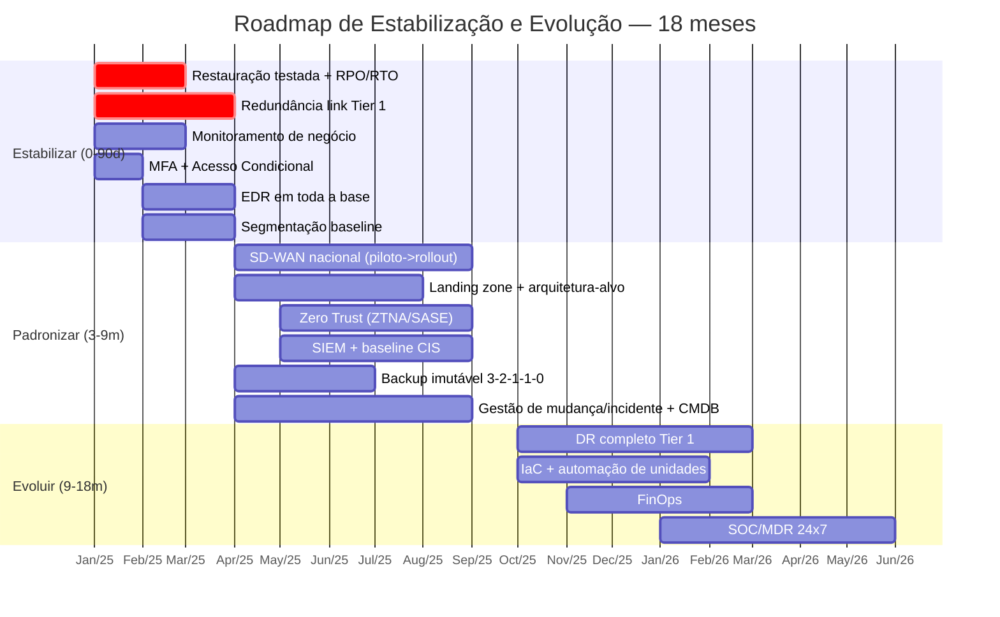

# 02 · Priorização e Roadmap (6–18 meses)

| Versão | Data | Autor | Revisão |
|--------|------|-------|---------|
| 1.0 | [A PREENCHER] | Durval | Inicial |

---

## 1. Como eu priorizo (o critério antes da lista)

Priorizar não é escolher o que é mais legal tecnicamente — é escolher o que **reduz mais risco ao
negócio por real investido, no menor prazo, com a capacidade de execução que eu tenho**. Uso um modelo
de pontuação simples e defensável:

**Score de priorização = (Impacto no negócio × Urgência) ÷ (Esforço × Risco de execução)**

| Fator | Escala | O que mede |
|-------|--------|------------|
| Impacto no negócio | 1–5 | Quanto afeta faturamento, logística, atendimento, conformidade |
| Urgência | 1–5 | Quão iminente é o dano se nada for feito |
| Esforço | 1–5 | Tempo, complexidade e dependências |
| Risco de execução | 1–5 | Chance de a própria mudança causar instabilidade |

Isso privilegia naturalmente os **quick wins de alto impacto e baixo esforço** — exatamente o que se
precisa nos primeiros 90 dias, quando o objetivo é **gerar confiança com resultados rápidos**.

---

## 2. Matriz Impacto × Esforço

```
   ALTO IMPACTO
        │
        │   [FAZER JÁ]                    │   [PLANEJAR BEM]
        │   • Restauração de backup       │   • SD-WAN nacional
        │     testada (Tier 1)            │   • DR em nuvem (Tier 1)
        │   • Redundância de link Tier 1  │   • Landing zone / arquitetura-alvo
        │   • MFA + Conditional Access    │   • SIEM/MDR centralizado
        │   • Monitoramento de negócio    │   • Zero Trust (ZTNA/SASE)
        │   • EDR em toda a base          │
────────┼──────────────────────────────────────────────────────── ESFORÇO ▶
        │   [OPORTUNISTA]                 │   [EVITAR / DEPOIS]
        │   • Padrão de VLAN/segmentação  │   • Reescrever tudo de uma vez
        │     baseline                    │   • Migração big-bang
        │   • Consolidação de fornecedores│   • Automação total antes do padrão
        │   • Inventário/CMDB inicial     │
   BAIXO IMPACTO
```

- **Fazer já:** alto impacto, baixo esforço → **entram no Plano de 90 Dias**.
- **Planejar bem:** alto impacto, alto esforço → fases 2 e 3, com piloto antes do rollout.
- **Oportunista:** baixo esforço → encaixar no caminho, aproveitando janelas.
- **Evitar:** alto esforço e/ou alto risco de execução sem retorno imediato → **não** no início.

---

## 3. Roadmap em três horizontes

### 🔴 Horizonte 1 — ESTABILIZAR (0–90 dias)
> **Objetivo:** parar o sangramento nas unidades críticas e criar visibilidade. Baixo custo, alto impacto.

| Frente | Ação | Por que agora |
|--------|------|---------------|
| Continuidade | Restauração de backup **testada** para todos os sistemas Tier 1; RPO/RTO definidos | Maior risco silencioso; barato de corrigir |
| Conectividade | Redundância de link (2º provedor ou LTE/5G) nas unidades **Tier 1** | Elimina ponto único que para o faturamento |
| Visibilidade | Monitoramento com **correlação de negócio** (serviços, não só servidores) | Sem isso, todo o resto é gasto cego |
| Identidade | **MFA** para 100% dos usuários + Acesso Condicional básico | Quick win via Entra ID já licenciado |
| Endpoint | **EDR/XDR** em toda a base (servidores + estações) | Reduz raio de ransomware imediatamente |
| Rede | **Segmentação baseline** (separar servidores, corp, guest, impressoras) | Contém movimento lateral |
| Fornecedores | Inventário de contratos + matriz de escalonamento | Acelera resposta a incidente sem custo |

### 🟠 Horizonte 2 — PADRONIZAR (3–9 meses)
> **Objetivo:** transformar exceções caras em padrão único, replicável e barato de escalar.

| Frente | Ação |
|--------|------|
| Conectividade | **SD-WAN** como arquitetura nacional padrão, com templates por tier |
| Arquitetura | **Landing zone** de nuvem + framework de decisão local/cloud/híbrido formalizado |
| Identidade | **Zero Trust** (ZTNA/SASE) substituindo VPN legada; PAM para acessos privilegiados |
| Segurança | **SIEM** centralizado + gestão de vulnerabilidades + baseline CIS nacional |
| Backup | **3-2-1-1-0** com cópias **imutáveis**; políticas por tier |
| Operação | Gestão formal de **incidentes e mudanças** (CAB) + **CMDB** |
| Fornecedores | Consolidação contratual com **SLA/OLA** e scorecards |

### 🟢 Horizonte 3 — EVOLUIR (9–18 meses)
> **Objetivo:** resiliência plena, automação e melhoria contínua. Crescer sem reinventar.

| Frente | Ação |
|--------|------|
| Continuidade | **DR completo** (site de contingência / DR em nuvem) para Tier 1, com testes periódicos |
| Automação | **IaC** (Terraform) e provisionamento padronizado de novas unidades |
| Custos | **FinOps** — governança de custo de nuvem, rightsizing, previsibilidade |
| Segurança | Evolução para **SOC/MDR** (detecção e resposta gerenciada 24×7) |
| Melhoria | Ciclo de **melhoria contínua** guiado por KPIs e revisões trimestrais |

---

## 4. Linha do tempo (visão executiva)



> *(As datas são relativas ao início do projeto — ajustar ao calendário real.)*

---

## 5. Princípios que atravessam todo o roadmap

1. **Piloto antes de rollout nacional.** Nada de big-bang. Cada padrão (SD-WAN, Zero Trust) valida em
   1–2 unidades antes de escalar.
2. **Padronizar o núcleo, flexibilizar a borda.** O padrão de arquitetura é nacional; o provedor de
   última milha se adapta à realidade regional.
3. **Cada fase entrega valor sozinha.** Se o orçamento travar no meio, o que já foi feito já reduziu risco.
4. **Medir antes e depois.** Toda frente tem baseline e meta — sem isso não há defesa de investimento.

---

**Detalhamento operacional do Horizonte 1:** ver [04 · Plano de 90 Dias](04-plano-90-dias.md).
**Racional de investimento e trade-offs:** ver [06 · Investimentos e Trade-offs](06-investimentos-e-tradeoffs.md).
