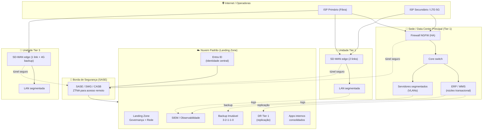
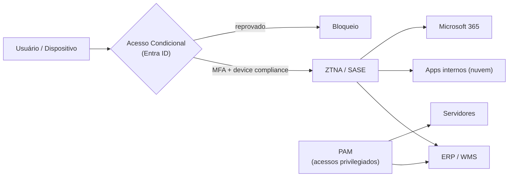
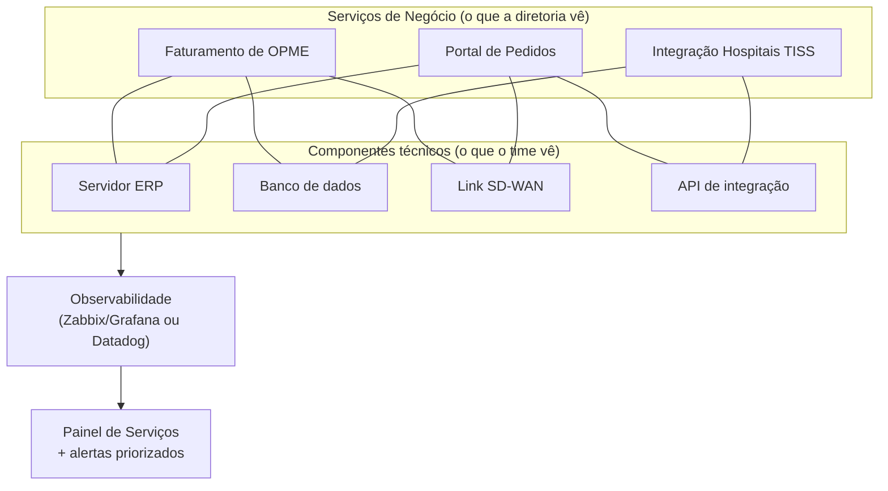
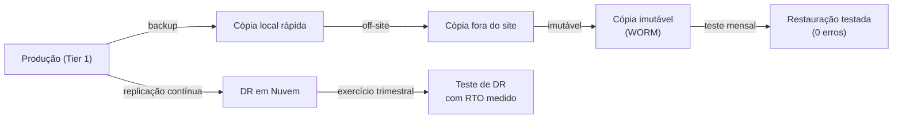

# 03 · Arquitetura-Alvo (TO-BE)

| Versão | Data | Autor | Revisão |
|--------|------|-------|---------|
| 1.0 |  | Durval | Inicial |

---

## 1. Princípios de arquitetura

Toda decisão técnica deste documento segue seis princípios, nesta ordem de prioridade:

1. **Disponibilidade proporcional à criticidade** — redundância onde para o negócio, simplicidade onde não para.
2. **Padrão nacional, adaptação regional** — um blueprint único; a última milha se ajusta à realidade local.
3. **Identidade como novo perímetro** — Zero Trust: nada é confiável por estar "dentro da rede".
4. **Segurança uniforme e por camadas** — a unidade mais fraca não pode definir o risco de todas.
5. **Continuidade testada, não presumida** — backup só vale se restaura; DR só vale se é exercitado.
6. **Observabilidade orientada ao negócio** — medir o serviço que gera receita, não só o servidor.

---

## 2. Framework de decisão: local, nuvem ou híbrido

O case aponta a ausência de **critérios objetivos** para essa decisão. Este é o framework proposto —
uma régua defensável, aplicada a cada workload:

| Critério | Favorece **On-premises** | Favorece **Nuvem** |
|----------|--------------------------|--------------------|
| Latência com o chão de operação (WMS, coletores) | Sensível a latência local | Tolerante |
| Gravidade de dados (volume + integração local) | Alta | Baixa |
| Requisito de disponibilidade | Já resolvido localmente | Precisa de resiliência geo-distribuída |
| Elasticidade / sazonalidade | Carga estável | Carga variável |
| Conformidade (ANVISA/LGPD) | Exige controle físico específico | Atendida por provedor certificado |
| Maturidade da equipe | Baixa em nuvem | Boa em nuvem |
| Custo (TCO 3 anos) | CAPEX já amortizado | OPEX previsível |

**Regra prática adotada:**
- **Núcleo transacional sensível a latência (ERP/WMS on-prem):** permanece **on-premises** ou em
  **colocation**, com DR em nuvem.
- **Sistemas de desenvolvimento interno, portais e integrações:** consolidados em **uma nuvem padrão**
  (landing zone), encerrando a dispersão multi-provedor.
- **Backup, DR e observabilidade:** **nuvem** (elasticidade e isolamento geográfico).

> Resultado: **híbrido intencional** — não híbrido por acidente. Cada workload tem um "porquê" documentado.

---

## 3. Visão geral da arquitetura-alvo

> Diagrama editável e versão AS-IS em [`docs/diagramas/`](diagramas/).

---

## 4. Camadas da arquitetura

### 4.1 Conectividade

| Item | Padrão-alvo |
|------|-------------|
| Topologia | **SD-WAN** com orquestração central e templates por tier |
| Tier 1 | **Dois links de operadoras distintas** (ativo/ativo ou ativo/backup) + failover automático |
| Tier 2 | Link principal + **backup LTE/5G** |
| Tier 3 | Link único + **4G/5G de contingência** (custo baixo, aciona só em falha) |
| Breakout | Saída de internet **local com segurança** (SASE) — evita "trombone" para a sede |
| Priorização | QoS para tráfego crítico (ERP, VoIP, integrações de faturamento) |

**Por que SD-WAN:** dá **padronização nacional** (um template por tier), **failover automático** (o
usuário não sente a queda de um link), **visibilidade centralizada** de todas as unidades e
**independência de operadora** — resolvendo de uma vez o ponto único de falha e a fragmentação.

### 4.2 Rede e segmentação

Modelo de segmentação **padrão nacional** (mesmas VLANs em toda unidade, facilitando operação e suporte remoto):

| VLAN | Segmento | Política |
|------|----------|----------|
| 10 | Servidores / núcleo | Acesso restrito, microssegmentação nos Tier 1 |
| 20 | Corporativo (estações) | Acesso a apps via identidade |
| 30 | Operação / coletores WMS | Isolado, só fala com WMS |
| 40 | Voz (VoIP) | QoS prioritário |
| 50 | Impressoras / IoT | Sem acesso à internet, isolado |
| 90 | Visitantes | Internet apenas, totalmente isolado |

**Racional:** segmentação é a defesa que **contém o raio de um incidente**. Um ransomware que entra
pela VLAN de visitantes ou impressoras **não alcança** os servidores.

### 4.3 Identidade e acesso (Zero Trust)

| Componente | Padrão-alvo |
|------------|-------------|
| IdP central | **Entra ID** como fonte única de identidade (SSO para tudo) |
| Autenticação | **MFA obrigatório** para 100% dos usuários |
| Autorização | **Acesso Condicional** (localização, risco, conformidade do dispositivo) |
| Acesso remoto | **ZTNA/SASE** substituindo VPN legada (acesso por aplicação, não por rede) |
| Privilégios | **PAM** + JIT (Just-in-Time) para contas administrativas |
| Governança | Revisão periódica de acessos (joiner/mover/leaver) |

**Por que Zero Trust:** com unidades distribuídas, sem suporte in-loco e acesso remoto crescente, o
perímetro de rede deixou de existir. **A identidade é o novo perímetro** — e a base (Entra ID) já existe.

### 4.4 Segurança (defesa em camadas)

| Camada | Controle-alvo |
|--------|---------------|
| Perímetro / borda | NGFW em HA nos Tier 1; **SASE** (SWG + CASB) para todas as unidades |
| Endpoint | **EDR/XDR** em 100% dos servidores e estações |
| E-mail | Proteção anti-phishing/anti-BEC (vetor nº 1 de ataque) |
| Identidade | MFA, Acesso Condicional, PAM (ver 4.3) |
| Vulnerabilidades | Varredura e **gestão de patch** com priorização por criticidade |
| Dados | Classificação + DLP para dados sensíveis (LGPD / rastreabilidade) |
| Monitoração | **SIEM** centralizado correlacionando logs de toda a base |
| Baseline | **CIS Controls v8** aplicado uniformemente em todas as unidades |

> Alinhamento a **NIST CSF 2.0**: Governar → Identificar → Proteger → Detectar → Responder → Recuperar.

### 4.5 Monitoramento e observabilidade

O salto conceitual: sair do monitoramento de **componentes** para o de **serviços de negócio**.

| Item | Padrão-alvo |
|------|-------------|
| Infra/rede | **Zabbix** (open-source, robusto) ou PRTG |
| Visualização | **Grafana** (painéis por serviço de negócio) |
| Correlação | **Mapa de serviço** ligando componente → impacto de negócio |
| Sintéticos | Testes que simulam a transação crítica ("emitir faturamento") de ponta a ponta |
| Alertas | Priorizados por **serviço afetado**, não por servidor; roteamento para escalonamento |

### 4.6 Backup, DR e continuidade

Padrão **3-2-1-1-0**:
- **3** cópias dos dados · **2** mídias diferentes · **1** fora do site · **1** imutável (anti-ransomware)
· **0** erros verificados (restauração testada).

| Tier de dado | RPO alvo | RTO alvo | Estratégia |
|--------------|:--------:|:--------:|------------|
| Tier 1 (ERP/WMS, faturamento, rastreabilidade) | ≤ 15 min | ≤ 2 h | Replicação + DR em nuvem, cópia imutável |
| Tier 2 (apps internos) | ≤ 4 h | ≤ 8 h | Backup diário incremental + cópia imutável |
| Tier 3 (arquivos gerais) | ≤ 24 h | ≤ 24 h | Backup diário padrão |

**Por que é a prioridade nº 1 de continuidade:** em OPME, os dados de rastreabilidade são
**obrigação regulatória**. Uma cópia imutável é a diferença entre "pagamos o resgate" e "restauramos
e seguimos". E só se sabe que funciona **testando**.

---

## 5. Requisitos de capacidade (capacity planning)

> `» Premissa` — dimensionar com dados reais na fase de descoberta.

| Recurso | Consideração de dimensionamento |
|---------|--------------------------------|
| SD-WAN | Throughput por tier + crescimento de 20%/ano; appliances com folga de CPU para inspeção |
| DR em nuvem | Capacidade para sustentar carga Tier 1 em contingência (não precisa espelhar 100% do parque) |
| Backup imutável | Retenção conforme exigência fiscal/ANVISA (reter dados de rastreabilidade pelo prazo legal) |
| SIEM | Volume de EPS (eventos/seg) × retenção; começar com Tier 1 e crescer |
| Identidade | Licenciamento Entra ID (validar tier P1/P2 para Acesso Condicional e PIM) |

---

## 6. Especificação de referência (agnóstica de fabricante)

O case não exige marca específica; o padrão define **capacidade**, não fornecedor:

| Domínio | Opção comercial | Opção open-source / econômica |
|---------|-----------------|-------------------------------|
| SD-WAN / NGFW | Fortinet (FortiGate + FortiManager), Cisco | pfSense/OPNsense (unidades menores) |
| Identidade | Microsoft Entra ID (já em uso) | — (alavancar o que já existe) |
| SASE/ZTNA | Zscaler, Netskope, Cloudflare, FortiSASE | — |
| Backup | Veeam, Acronis | Bacula |
| Monitoramento | Datadog, PRTG | **Zabbix + Grafana + Prometheus** |
| SIEM | Microsoft Sentinel, Splunk | Wazuh (open-source) |
| EDR/XDR | CrowdStrike, Microsoft Defender for Endpoint | — |
| IaC | Terraform | Terraform (já é o padrão de mercado) |

> **Alavancagem estratégica:** priorizar o ecossistema **Microsoft (Entra ID + Defender + Sentinel)**
> onde já há licenciamento reduz custo e curva de aprendizado — decisão detalhada em
> [06 · Investimentos e Trade-offs](06-investimentos-e-tradeoffs.md).

---

**Como isso vira execução:** ver [04 · Plano de 90 Dias](04-plano-90-dias.md) e os
[processos operacionais ITIL](08-processos-itil.md) que sustentam a arquitetura no dia a dia.
