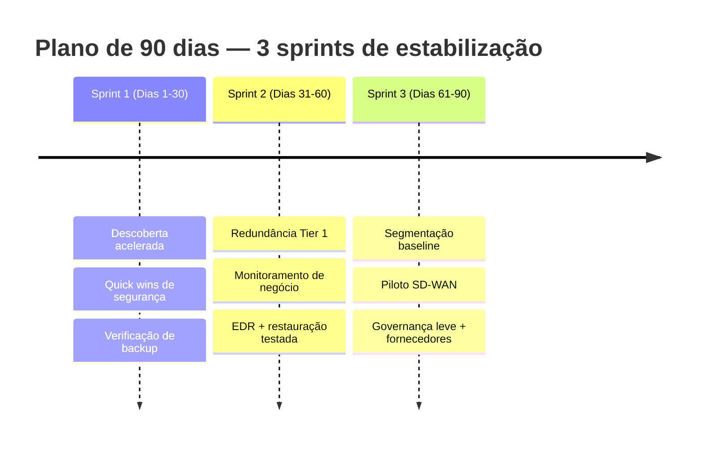

# 04 · Plano de Ação — Primeiros 90 Dias

| Versão | Data | Autor | Revisão |
|--------|------|-------|---------|
| 1.0 | [A PREENCHER] | Durval | Inicial |

---

## 1. Objetivo dos 90 dias

**Estabilizar o que para a operação e criar visibilidade** — com resultados medíveis já no primeiro
trimestre, usando ao máximo o que já existe (licenças Microsoft/Entra ID) e reservando os grandes
investimentos para depois do padrão validado.

> **Filosofia:** os 90 dias não são para "resolver tudo" — são para **eliminar os três riscos
> críticos** (backup, link único, segurança desigual), **provar valor rápido** e **construir a base**
> (visibilidade + identidade) sobre a qual as fases 2 e 3 vão rodar.

---

## 2. Estrutura em 3 sprints

---

## 3. Sprint 1 — Dias 1 a 30: Enxergar e proteger o básico

| # | Ação | Entregável | Como medir |
|---|------|-----------|------------|
| 1.1 | **Descoberta acelerada**: inventário de unidades, links, sistemas e classificação por tier | Inventário + CMDB inicial | % do parque mapeado |
| 1.2 | **Ativar MFA** para 100% dos usuários (Entra ID) | MFA em produção | % de usuários com MFA |
| 1.3 | **Acesso Condicional básico** (bloquear legado, exigir device compliance) | Políticas ativas | Nº de políticas / cobertura |
| 1.4 | **Auditar backups atuais** e disparar 1º teste de restauração dos sistemas Tier 1 | Relatório de restore | Restore Tier 1 bem-sucedido (S/N) |
| 1.5 | **Inventário de fornecedores e contratos** + matriz de escalonamento provisória | Matriz de escalonamento | Fornecedores mapeados |
| 1.6 | Levantar **linha de base** de disponibilidade e incidentes (mesmo que manual) | Baseline documentado | Baseline registrado |

**Resultado esperado do Sprint 1:** a empresa passa a **ter MFA universal** (redução imediata de risco
de credencial), a **saber se consegue restaurar** os sistemas críticos e a **ter um mapa** de onde estão
os riscos.

---

## 4. Sprint 2 — Dias 31 a 60: Eliminar os pontos únicos

| # | Ação | Entregável | Como medir |
|---|------|-----------|------------|
| 2.1 | **Contratar/ativar redundância de link** nas unidades **Tier 1** (2º provedor ou LTE/5G) | Redundância operante | % de Tier 1 com redundância |
| 2.2 | **Implantar monitoramento de negócio** (Zabbix + Grafana) com mapa de serviço para os 3–5 serviços críticos | Painel de serviços | Serviços críticos monitorados |
| 2.3 | **Rollout de EDR/XDR** em servidores e estações | EDR em produção | % de cobertura EDR |
| 2.4 | **Rotina de restauração testada** para Tier 1 (mensal) + definição de RPO/RTO | Procedimento + calendário | % Tier 1 com restore testado |
| 2.5 | **Proteção de e-mail** reforçada (anti-phishing/BEC) | Regras ativas | Redução de phishing entregue |

**Resultado esperado do Sprint 2:** **nenhuma unidade Tier 1 depende de um único link**; o time
**enxerga o negócio** (não só servidores); e o **EDR reduz o raio de um ransomware** em toda a base.

---

## 5. Sprint 3 — Dias 61 a 90: Conter e padronizar

| # | Ação | Entregável | Como medir |
|---|------|-----------|------------|
| 3.1 | **Segmentação baseline** (VLANs padrão) começando pelos Tier 1 | Rede segmentada | % de unidades segmentadas |
| 3.2 | **Piloto de SD-WAN** em 1–2 unidades (validar o padrão nacional) | Piloto funcional | Piloto aprovado (S/N) |
| 3.3 | **Governança leve**: processo de incidentes e mudanças (CAB semanal) | Processos publicados | Rituais em operação |
| 3.4 | **Consolidação inicial de fornecedores** + SLA provisório para Tier 1 | Acordos de SLA | Fornecedores com SLA |
| 3.5 | **Relatório de fechamento dos 90 dias** com resultados vs. baseline | Relatório executivo | Metas atingidas (%) |

**Resultado esperado do Sprint 3:** a rede passa a **conter incidentes** (segmentação); o **padrão de
conectividade está validado** para escalar na fase 2; e a operação ganha **rituais de governança** que
sustentam tudo daqui pra frente.

---

## 6. Indicadores e metas dos 90 dias

| Indicador | Baseline (a medir) | Meta 90 dias | Fonte |
|-----------|:------------------:|:------------:|-------|
| Cobertura de MFA | — | 100% dos usuários | Entra ID |
| Unidades Tier 1 com redundância de link | — | 100% | Inventário SD-WAN |
| Sistemas Tier 1 com **restauração testada** | ~0% | 100% | Relatório de restore |
| Cobertura de EDR | — | ≥ 95% | Console EDR |
| Serviços de negócio monitorados | 0 | ≥ 5 principais | Painel Grafana |
| Unidades Tier 1 segmentadas | — | 100% | Config de rede |
| MTTD (tempo médio de detecção) | Medir no Sprint 1 | ↓ ≥ 40% | Monitoramento |
| Fornecedores críticos com escalonamento definido | — | 100% | Matriz de escalonamento |

> **Regra de ouro:** o que não tem baseline no Sprint 1 **não pode reivindicar melhoria** no fim.
> Por isso a medição da linha de base é a primeira entrega.

---

## 7. Recursos e dependências

| Necessidade | Observação |
|-------------|------------|
| Apoio da liderança de TI | Assumido (premissa do case) — essencial para priorização e acesso |
| Orçamento tático | Baixo nos 90 dias: MFA/Acesso Condicional cabem em licenças existentes; maior custo é link redundante e EDR |
| Janelas de manutenção | Segmentação e piloto SD-WAN exigem janelas — coordenar por tier |
| Fornecedores | Colaboração dos provedores de link e sistemas para redundância e SLA |
| Time | Squad enxuto + apoio de fornecedores; sem depender de contratação nova nesta fase |

---

## 8. Riscos do próprio plano (e mitigação)

| Risco de execução | Mitigação |
|-------------------|-----------|
| Janela de manutenção indisponível em unidade crítica | Executar mudanças em horários de baixa operação; rollback pronto |
| Piloto SD-WAN atrasar por operadora | Piloto não bloqueia os demais ganhos; segue em paralelo |
| Restauração de backup falhar no 1º teste | **Isso é um achado, não um fracasso** — expõe o risco real e prioriza a correção |
| Resistência a MFA | Comunicação + rollout faseado por grupo; suporte reforçado na virada |

---

**Onde isso se conecta:** o sucesso dos 90 dias habilita o [Horizonte 2 do Roadmap](02-priorizacao-e-roadmap.md)
e é sustentado pela [Governança Operacional](05-governanca-operacional.md).
