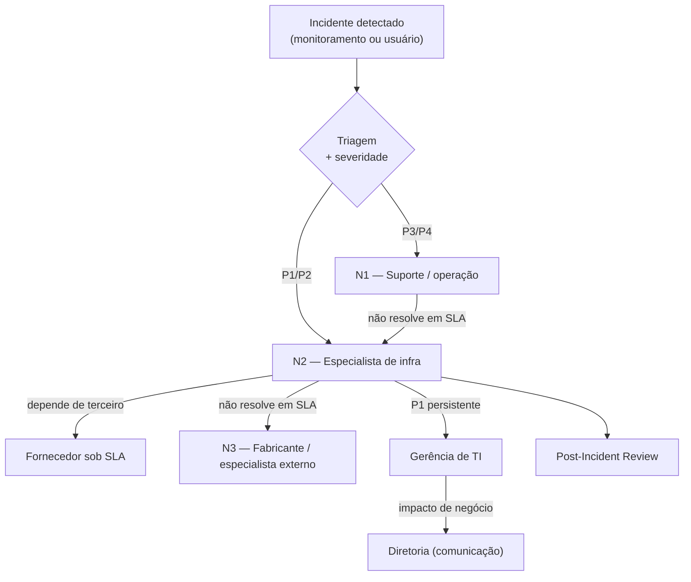

# 05 · Governança Operacional

| Versão | Data | Autor | Revisão |
|--------|------|-------|---------|
| 1.0 | [A PREENCHER] | Durval | Inicial |

---

## 1. Por que governança (e não só tecnologia)

Uma boa arquitetura sem governança **se degrada em meses**. Governança é o que garante que o padrão
seja mantido, que os incidentes sejam tratados com consistência e que a diretoria tenha
**previsibilidade e visão centralizada** — três coisas explicitamente pedidas no case. Estrutura em
quatro pilares: **indicadores, rituais, responsabilidades e gestão de fornecedores.**

---

## 2. Indicadores (KPIs) — o que se mede é o que melhora

### 2.1 Indicadores de negócio (para a diretoria)

| KPI | Definição | Meta de referência |
|-----|-----------|--------------------|
| Disponibilidade de serviços críticos | % de uptime dos serviços de negócio Tier 1 | ≥ 99,5% (evoluindo a 99,9%) |
| Impacto de indisponibilidade | Horas de indisponibilidade × criticidade da unidade | Tendência de queda |
| Custo de TI por unidade | OPEX total ÷ nº de unidades | Previsível e decrescente por padronização |
| Aderência de SLA de fornecedores | % de chamados dentro do SLA | ≥ 95% |

### 2.2 Indicadores operacionais (para o time)

| KPI | Definição | Meta de referência |
|-----|-----------|--------------------|
| MTTD | Tempo médio para **detectar** incidente | ↓ contínuo |
| MTTR | Tempo médio para **resolver** incidente | ↓ contínuo |
| Taxa de restauração testada | % de sistemas com restore validado no período | 100% Tier 1 |
| Sucesso de mudanças | % de mudanças sem incidente associado | ≥ 95% |
| Cobertura de patch | % de ativos com patches críticos em dia | ≥ 90% |
| Cobertura de EDR/MFA | % de ativos/usuários cobertos | 100% |

> **Painel único:** todos consolidados em um dashboard (Grafana) com visão executiva e visão técnica.

---

## 3. Rituais (a cadência que sustenta a operação)

| Ritual | Frequência | Participantes | Objetivo |
|--------|-----------|---------------|----------|
| **Daily de operação** | Diário (15 min) | Time de infra | Incidentes abertos, prioridades do dia |
| **CAB — Comitê de Mudanças** | Semanal | Infra + solicitantes | Aprovar/agendar mudanças, avaliar risco |
| **Revisão de serviço** | Semanal | Time de infra | KPIs operacionais, incidentes da semana |
| **Post-Incident Review (PIR)** | Após cada incidente P1/P2 | Envolvidos | Causa-raiz e ações preventivas (blameless) |
| **Steering de TI** | Mensal | TI + gerência | Progresso do roadmap, riscos, decisões |
| **Business Review** | Trimestral | TI + diretoria | KPIs de negócio, investimentos, próximos passos |
| **Scorecard de fornecedores** | Mensal | Infra + compras | Avaliar SLA e desempenho dos parceiros |

---

## 4. Responsabilidades (RACI)

**R** = Responsável (executa) · **A** = Aprova (dono) · **C** = Consultado · **I** = Informado

| Atividade | Especialista Infra | Gerência TI | Fornecedor | Diretoria | Unidades |
|-----------|:------------------:|:-----------:|:----------:|:---------:|:--------:|
| Definição de arquitetura-alvo | R/A | C | C | I | I |
| Aprovação de mudanças (CAB) | R | A | C | I | I |
| Resposta a incidente P1 | R/A | I | C | I | I |
| Restauração / DR | R/A | I | C | I | I |
| Gestão de SLA de fornecedores | R | A | I | I | — |
| Priorização de roadmap | R | A | — | C | I |
| Aprovação de investimento | C | R | — | A | — |
| Segurança / conformidade (LGPD/ANVISA) | R | A | C | I | I |

> **Modelo operacional:** especialista de infra como **ponto central de arquitetura e resposta**,
> apoiado por squad enxuto e fornecedores sob SLA. Sem suporte in-loco, a operação remota depende de
> **padronização** (mesmo layout de rede em toda unidade) e **automação**.

---

## 5. Matriz de escalonamento e severidade

### 5.1 Classificação de severidade

| Severidade | Definição | Exemplo OPME | Tempo de resposta | Tempo de resolução alvo |
|:----------:|-----------|--------------|:-----------------:|:-----------------------:|
| **P1 — Crítico** | Parada de serviço crítico ou unidade Tier 1 | Faturamento/ERP fora do ar; hospital sem integração | ≤ 15 min | ≤ 2 h |
| **P2 — Alto** | Degradação grave ou unidade Tier 2 parada | Lentidão que impede separação de pedidos | ≤ 30 min | ≤ 4 h |
| **P3 — Médio** | Impacto localizado, com contorno | Um usuário sem acesso a um sistema | ≤ 4 h | ≤ 1 dia útil |
| **P4 — Baixo** | Sem impacto operacional | Solicitação de melhoria | ≤ 1 dia útil | Conforme planejamento |

### 5.2 Fluxo de escalonamento

**Princípio:** para P1, o escalonamento é **automático por tempo** — se não resolve no SLA, sobe
sozinho. Ninguém precisa "lembrar de escalar". E a diretoria é **informada**, não acionada para operar.

---

## 6. Gestão de fornecedores

O case aponta fragmentação como problema real. A resposta é **consolidar e contratualizar**:

| Frente | Ação |
|--------|------|
| Consolidação | Reduzir nº de provedores redundantes; preferir parceiros com cobertura nacional |
| Contratos | **SLA** claros (disponibilidade, tempo de resposta/resolução) + penalidades |
| OLA | Acordos internos alinhados aos SLA externos (a promessa ao negócio é sustentada pela cadeia) |
| Ponto único | Cada fornecedor com **canal e responsável definidos** para escalonamento |
| Scorecard | Avaliação mensal objetiva: aderência de SLA, qualidade, tempo de resposta |
| Governança | Revisão contratual periódica; não renovar quem não performa |

**Regra de flexibilidade regional:** onde a cobertura nacional não alcança (última milha em cidade
menor), aceita-se provedor local — **mas dentro do padrão de SLA e integrado ao monitoramento central**.
Flexibilidade não é abrir mão de padrão de qualidade.

---

## 7. Conformidade embutida na governança

| Requisito | Como a governança atende |
|-----------|--------------------------|
| **LGPD** | Controle de acesso por identidade, segmentação, DLP, trilha de auditoria (SIEM) |
| **ANVISA (rastreabilidade)** | Retenção de dados por prazo legal, backup imutável, integridade verificada |
| **ITIL 4** | Gestão de mudança, incidente, disponibilidade e continuidade formalizadas |
| **Auditoria** | Logs centralizados e imutáveis; relatórios periódicos |

---

**Detalhe dos processos:** ver [08 · Processos Operacionais (ITIL)](08-processos-itil.md).
**KPIs no contexto de investimento:** ver [06 · Investimentos e Trade-offs](06-investimentos-e-tradeoffs.md).
