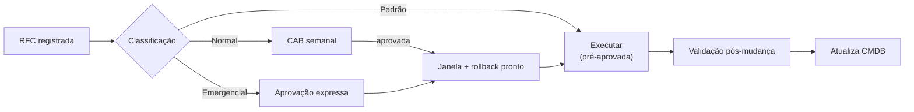

# 08 · Processos Operacionais (ITIL)

| Versão | Data | Autor | Revisão |
|--------|------|-------|---------|
| 1.0 |  | Durval | Inicial |

Este documento formaliza os processos que sustentam a arquitetura no dia a dia. Cada um segue a
estrutura ITIL: objetivo, escopo, responsáveis, entradas, fluxo, saídas, KPIs, ferramentas e exceções.

---

## 8.1 Gerenciamento de Incidentes

- **Objetivo:** restaurar o serviço no menor tempo possível, minimizando o impacto ao negócio.
- **Escopo:** todos os incidentes que afetem serviços de TI; exclui requisições de serviço (fluxo próprio).
- **Responsáveis (RACI):** N1 (R), Especialista Infra (R/A em P1/P2), Fornecedor (C), Gerência TI (I).
- **Entradas:** alerta de monitoramento, chamado de usuário, notificação de fornecedor.

**Fluxo:**
1. Detecção (monitoramento de negócio ou usuário) e registro no service desk.
2. Triagem e **classificação de severidade** (P1–P4, ver Governança §5).
3. Diagnóstico inicial; tentativa de contorno (workaround) para restaurar serviço.
4. Escalonamento automático por tempo se não resolver no SLA da severidade.
5. Resolução e restauração; validação com o solicitante.
6. Encerramento e registro da causa.
7. **PIR** obrigatório para P1/P2 (blameless).

- **Saídas:** serviço restaurado, registro de incidente, ações preventivas.
- **KPIs:** MTTD, MTTR, % dentro do SLA, taxa de reincidência.
- **Ferramentas:** service desk, Zabbix/Grafana (detecção), SIEM (correlação).
- **Exceções:** incidente de segurança confirmado aciona o **plano de resposta a incidentes** (contenção → erradicação → recuperação → lições aprendidas).

---

## 8.2 Gerenciamento de Mudanças (Change Management)

- **Objetivo:** implementar mudanças com o mínimo de risco e interrupção.
- **Escopo:** toda alteração em ambiente de produção (rede, servidores, nuvem, segurança).
- **Responsáveis:** Especialista Infra (R), CAB (A), Solicitante (C), Unidades (I).
- **Entradas:** requisição de mudança (RFC), incidente que exige correção, item de roadmap.

**Fluxo:**
1. Registro da RFC com escopo, justificativa, impacto e **plano de rollback**.
2. Classificação: **padrão** (pré-aprovada, baixo risco), **normal** (vai ao CAB), **emergencial** (aprovação expressa).
3. Avaliação de risco e janela de manutenção.
4. Aprovação no **CAB semanal** (normal) ou fast-track (emergencial).
5. Execução na janela, com rollback pronto.
6. Validação pós-mudança e comunicação.
7. Registro do resultado (sucesso/rollback).

- **Saídas:** mudança implementada e documentada, CMDB atualizado.
- **KPIs:** % de mudanças bem-sucedidas, % sem incidente associado, mudanças emergenciais (tendência de queda).
- **Ferramentas:** service desk, CMDB, calendário de mudanças.
- **Exceções:** mudança emergencial pode pular o CAB, mas exige revisão retroativa na reunião seguinte.

---

## 8.3 Gerenciamento de Disponibilidade

- **Objetivo:** garantir que os serviços atendam aos níveis de disponibilidade acordados por tier.
- **Escopo:** serviços de negócio críticos (Tier 1) e importantes (Tier 2).
- **Responsáveis:** Especialista Infra (R/A), Gerência TI (I).
- **Entradas:** metas de SLA, dados de monitoramento, mapa de serviços.

**Fluxo:**
1. Definir metas de disponibilidade por serviço (99,5% → 99,9% para Tier 1).
2. Monitorar continuamente com correlação de negócio.
3. Identificar pontos únicos de falha e eliminá-los (redundância por tier).
4. Analisar tendências e capacidade proativamente.
5. Reportar disponibilidade nos rituais de serviço.

- **Saídas:** relatório de disponibilidade, plano de melhoria.
- **KPIs:** % de uptime por serviço, nº de pontos únicos de falha remanescentes.
- **Ferramentas:** Zabbix/Grafana, painel de serviços, checks sintéticos.
- **Exceções:** manutenção planejada é excluída do cálculo de indisponibilidade (comunicada previamente).

---

## 8.4 Gerenciamento de Backup e Continuidade (DR)

- **Objetivo:** assegurar recuperação confiável de dados e serviços após falha ou desastre.
- **Escopo:** todos os dados corporativos, com prioridade para Tier 1 (ERP/WMS, faturamento, rastreabilidade).
- **Responsáveis:** Especialista Infra (R/A), Fornecedor de nuvem (C), Gerência TI (I).
- **Entradas:** políticas de RPO/RTO por tier, calendário de testes.

**Fluxo:**
1. Executar backups conforme política **3-2-1-1-0** por tier.
2. Manter **cópia imutável** (WORM) contra ransomware.
3. **Testar restauração** em rotina (mensal para Tier 1) — sem teste, o backup não é considerado válido.
4. Exercitar **DR** trimestralmente, medindo RTO real.
5. Registrar resultados e corrigir desvios.

- **Saídas:** relatório de backup/restore, evidência de DR testado, RTO/RPO medidos.
- **KPIs:** % de backups bem-sucedidos, **% de restaurações testadas**, RTO real vs. alvo.
- **Ferramentas:** Veeam/Acronis ou Bacula, storage imutável, DR em nuvem.
- **Exceções:** falha de restore aciona incidente P2 e correção prioritária.

---

## 8.5 Gestão de Identidade e Acesso (IAM)

- **Objetivo:** garantir que apenas pessoas certas acessem os recursos certos, pelo tempo certo.
- **Escopo:** todas as identidades (colaboradores, terceiros, contas de serviço).
- **Responsáveis:** Especialista Infra (R/A), RH (C, para joiner/leaver), Gerência TI (I).
- **Entradas:** admissão/movimentação/desligamento (RH), solicitação de acesso.

**Fluxo:**
1. Provisionamento via Entra ID (SSO) no onboarding.
2. **MFA obrigatório** e **Acesso Condicional** (risco, dispositivo, localização).
3. Acesso por **menor privilégio**; privilegiados via **PAM/JIT**.
4. Revisão periódica de acessos (recertificação).
5. **Desprovisionamento imediato** no desligamento (mover/leaver).

- **Saídas:** identidade gerenciada, trilha de auditoria.
- **KPIs:** cobertura de MFA (100%), % de acessos recertificados, tempo de desprovisionamento.
- **Ferramentas:** Entra ID, PAM, SIEM (auditoria).
- **Exceções:** conta de serviço sem MFA usa autenticação forte alternativa + monitoração dedicada.

---

## 8.6 Gestão de Configuração (CMDB)

- **Objetivo:** manter uma fonte confiável dos ativos de TI e suas relações.
- **Escopo:** ativos de infra (rede, servidores, links, licenças) e dependências com serviços.
- **Responsáveis:** Especialista Infra (R/A).
- **Entradas:** inventário inicial (Sprint 1), mudanças aprovadas.

**Fluxo:**
1. Inventariar e classificar ativos por tier.
2. Mapear **dependências ativo → serviço de negócio** (base do monitoramento correlacionado).
3. Atualizar a cada mudança aprovada (integrado ao Change Management).
4. Auditar periodicamente a acurácia.

- **Saídas:** CMDB atualizado, mapa de serviços.
- **KPIs:** acurácia do CMDB (%), % de ativos mapeados a serviços.
- **Ferramentas:** NetBox (IPAM/inventário) ou módulo de CMDB do service desk.

---

## 8.7 Gestão de Fornecedores

- **Objetivo:** garantir que fornecedores entreguem dentro dos SLAs e sustentem os serviços ao negócio.
- **Escopo:** provedores de internet, suporte de sistemas, parceiros regionais, nuvem.
- **Responsáveis:** Gerência TI (A), Especialista Infra (R), Compras (C).
- **Entradas:** contratos, SLAs, scorecards mensais.

**Fluxo:**
1. Consolidar fornecedores e formalizar **SLA/OLA**.
2. Definir canal e responsável de **escalonamento** por fornecedor.
3. Medir desempenho mensalmente (scorecard).
4. Revisar contratos periodicamente; não renovar quem não performa.

- **Saídas:** scorecard, plano de ação por fornecedor.
- **KPIs:** aderência de SLA (≥95%), tempo médio de resposta, nº de fornecedores consolidados.
- **Ferramentas:** service desk (tickets a fornecedores), planilha/painel de scorecard.
- **Exceções:** provedor de última milha regional é aceito fora do padrão de porte, mas **dentro do SLA**.

---

> Estes processos são introduzidos de forma **leve nos 90 dias** (incidente, mudança, backup) e
> **amadurecidos nas fases 2 e 3** (CMDB, disponibilidade, fornecedores formais). O objetivo é
> governança que **habilita** a operação, não burocracia que a trava.
